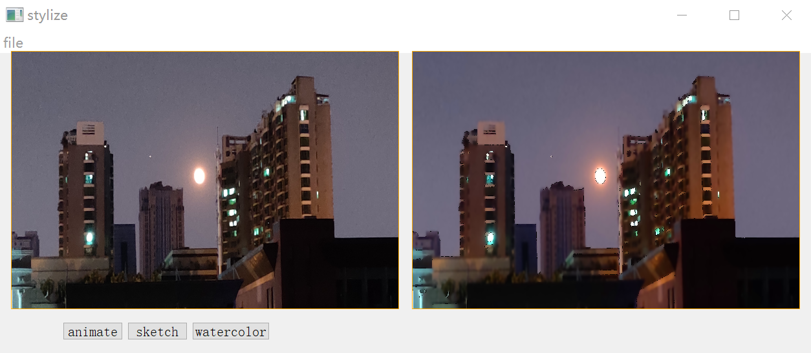
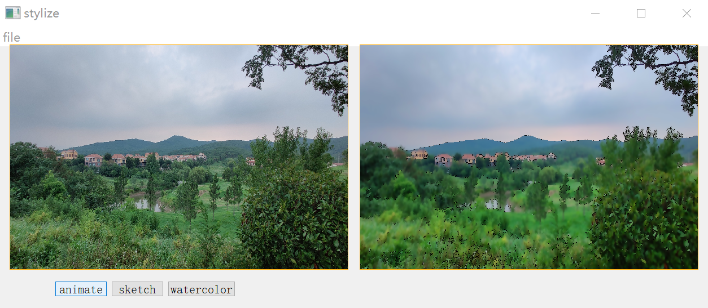
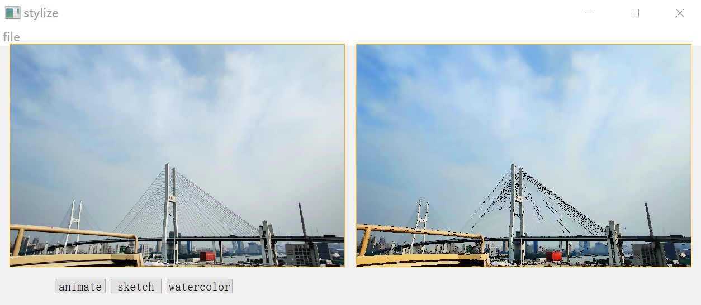
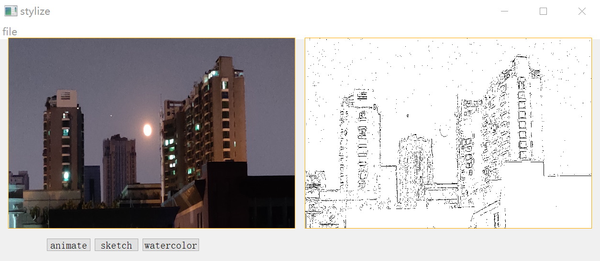
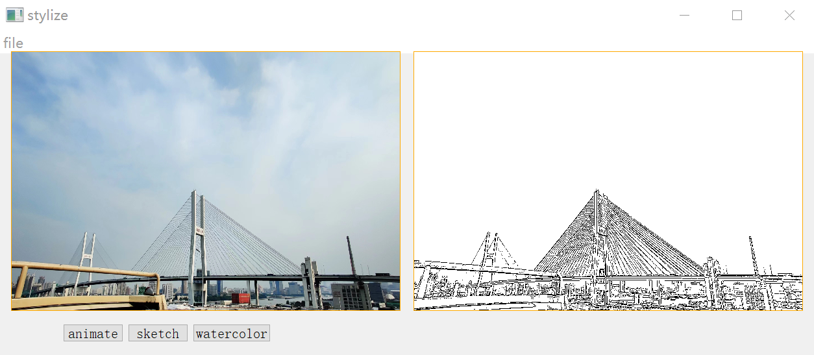
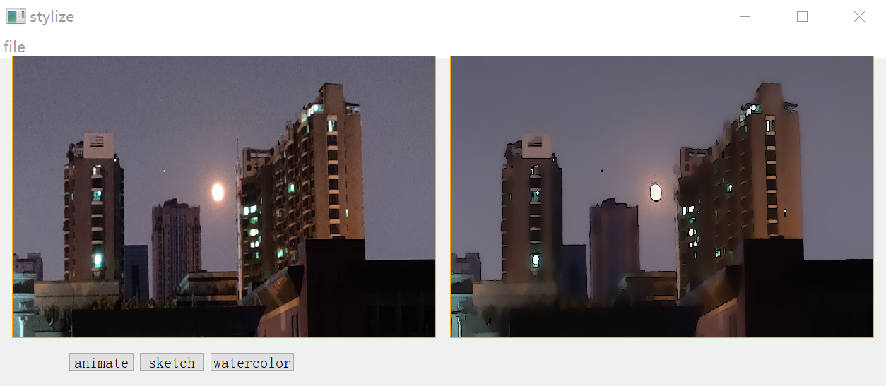
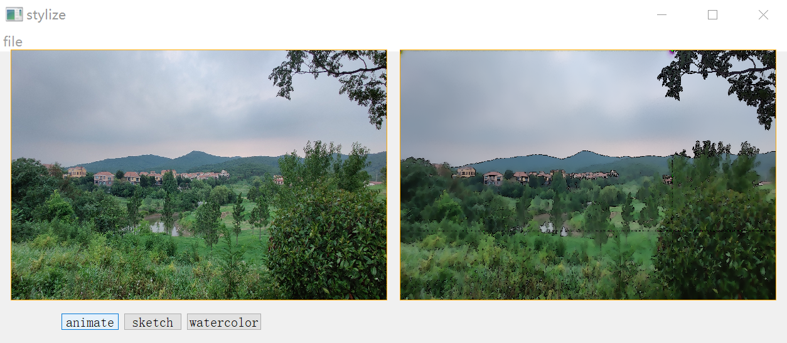
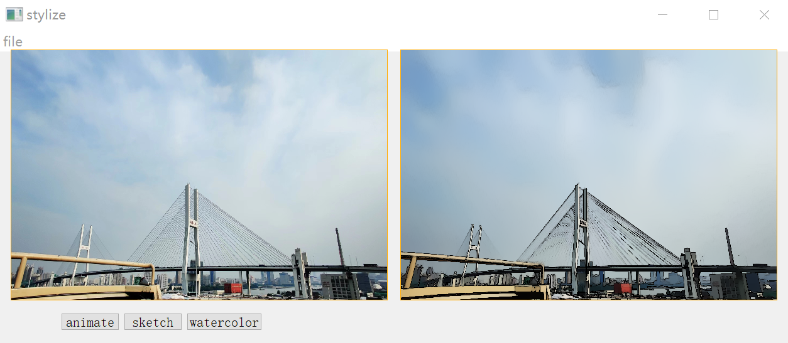

# README

### This is small python program I wrote using OpenCV to create animation effects, sketch effects and watercolor effects for photos.

#### Here are the results of animation effects:

***The original photo is on the left and the animated photo is on the right.***

#### Here are the results of sketch effects:

***The original photo is on the left and the sketch photo is on the right.***

#### Here are the results of watercolor effects:

***The original photo is on the left and the watercolor photo is on the right.***

